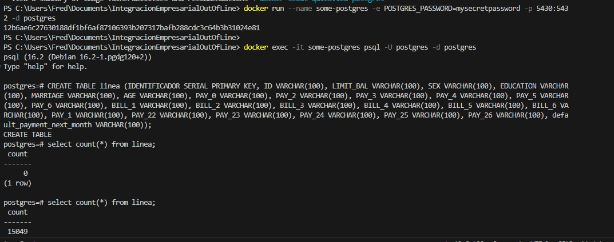
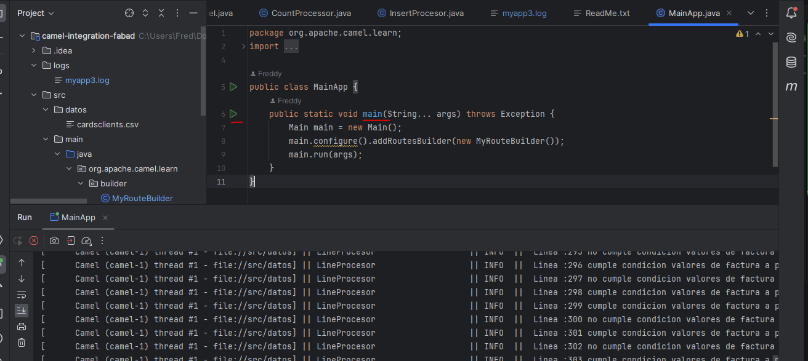
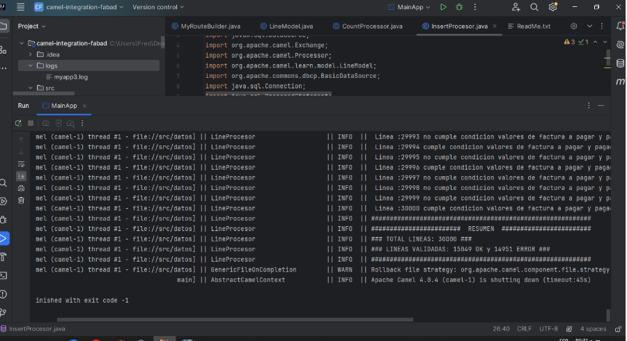
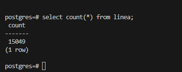
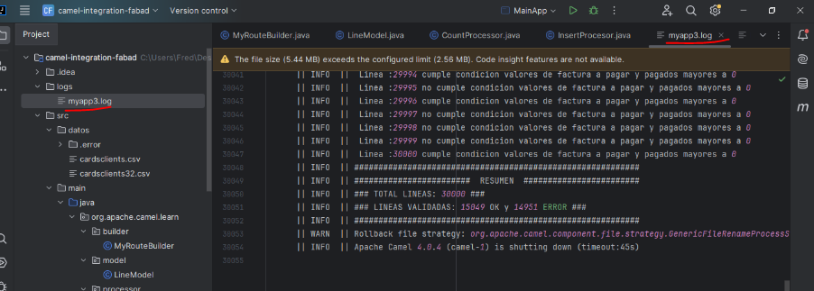
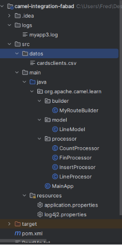

# IntegracionEmpresarialOutOfLine
Author: Freddy Abad

UPS - Departamento de Posgrados

### PREREQUISITOS
Ejecutar los siguientes comandos para levantar un contenedor de postgres en Docker :

```bash
docker pull postgres

docker run --name some-postgres -e POSTGRES_PASSWORD=mysecretpassword -p 5430:5432 -d postgres

docker exec -it some-postgres psql -U postgres -d postgres

CREATE TABLE linea (IDENTIFICADOR SERIAL PRIMARY KEY, ID VARCHAR(100), LIMIT_BAL VARCHAR(100), SEX VARCHAR(100), EDUCATION VARCHAR(100), MARRIAGE VARCHAR(100), AGE VARCHAR(100), PAY_0 VARCHAR(100), PAY_2 VARCHAR(100), PAY_3 VARCHAR(100), PAY_4 VARCHAR(100), PAY_5 VARCHAR(100), PAY_6 VARCHAR(100), BILL_1 VARCHAR(100), BILL_2 VARCHAR(100), BILL_3 VARCHAR(100), BILL_4 VARCHAR(100), BILL_5 VARCHAR(100), BILL_6 VARCHAR(100), PAY_1 VARCHAR(100), PAY_22 VARCHAR(100), PAY_23 VARCHAR(100), PAY_24 VARCHAR(100), PAY_25 VARCHAR(100), PAY_26 VARCHAR(100), default_payment_next_month VARCHAR(100));

select count(*) from linea;

```
A continuacion se detalla una imagen referencial:



### PARA CORRER EL PROYECTO

En caso se requerir modificar las credenciales de conexion a la base, o de cambiar el nombre del archivo a validar, dirigirse al archivo (src/main/resources/application.properties)
Las variables ruta :

```bash
ruta=src/datos #referencia ubicacion de carpeta de archivo a validar
filename=cardsclients.csv #referencia nombre de archivo a validar
#Datos conexion a base
database.jdbc.connection=jdbc:postgresql://localhost:5430/postgres
database.user=postgres
database.password=mysecretpassword
```


Para correr el proyecto, run en el metodo Main del proyecto (archivo src/main/java/org/apache/camel/learn/MainApp.java)



Como resultado se tiene la validacion e insercion en base de datos si cumple con las condiciones, adicional al finalizar la validacion del archivo imprime un log con el total de lineas ok y error.



Asi como tambien, se valida a nivel de base de datos el total de registros insertados, que es igual al total de lineas validadas ok.


Los logs adicional a mostrarse en la consola-terminal, es persistido en un archivo (camel-integration-fabad/logs/myapp3.log)



### INFORMACION DEL PROYECTO

El proyecto se genero usando Apache Camel como herramienta orientada a integracion empresarial.

##### ESTRUCTURA DEL PROYECTO
Como se ve en la siguiente imagen se tiene una jerarquia dentro del proyecto (camel-integration-fabad/src/main/java/org/apache/camel/learn):

builder: Clase que extiende de RouteBuilder, donde se detalla el flujo a seguir en la validacion, insercion, logs.

model: Clase que modela cada linea para el manejo interno del servicio.

processor: Clases que contienen la logica de cada uno de los pasos establecidos en el paquete builder



#### Requerimientos abordados en el proyecto

Uso de un framework de integración (Apache Camel)
Proceso de lectura y validacion del archivo en formato CSV
Insercion en base de datos cuando cumple la validacion:

El valor de la factura a pagar no puede ser menor o igual a cero.

El valor pagado no puede ser menor o igual a cero.

Presentar un log o registros en el cual se especifique la cantidad de información que se carga y la que presento errores de validación
